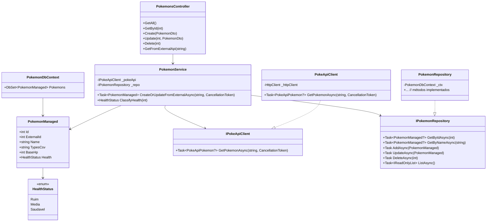

# CentroPokemon ⚡🧬

API RESTful para gerenciamento e monitoramento de Pokémons, desenvolvida com **.NET** e **Entity Framework Core**, utilizando banco de dados Oracle e integração com PokéAPI externa.

---

## ✅ Funcionalidades

- CRUD de Pokémons  
- Consulta de Pokémons na PokéAPI externa  
- Classificação de saúde dos Pokémons  
- Documentação automática da API via OpenAPI (Swagger)  

---

## 📌 Endpoints Principais

### 🧬 Pokémons

- `GET /api/pokemons` — Lista todos os Pokémons  
- `GET /api/pokemons/{id}` — Detalha um Pokémon  
- `POST /api/pokemons` — Cria um novo Pokémon  
- `PUT /api/pokemons/{id}` — Atualiza um Pokémon  
- `DELETE /api/pokemons/{id}` — Remove um Pokémon  
- `GET /api/pokemons/external/{name}` — Consulta dados na PokéAPI e salva/atualiza localmente  

---

## 📖 Documentação da API - Swagger (OpenAPI)

- Acesse `/swagger` após executar a aplicação  
- Interface interativa para testar endpoints  
- Visualização de modelos, parâmetros e respostas  

---

## 🗂️ Estrutura do Projeto

- `Application`: Serviços, contratos e integração com PokéAPI  
- `Domain`: Entidades de domínio e interfaces de repositório  
- `Infrastructure`: EF Core, Migrations e Contexto  
- `WebApiBanco`: Controllers, configuração e Swagger  
- `MvcApp`: Front-end Razor

---

## 🧠 Princípios SOLID Evidentes

Este projeto foi desenvolvido seguindo boas práticas de arquitetura e programação orientada a objetos, especialmente os princípios SOLID:

- **SRP (Single Responsibility Principle):**
  - Cada classe tem uma responsabilidade única. Por exemplo, `PokemonService` cuida apenas da lógica de negócio, enquanto `PokemonRepository` trata da persistência, e `PokeApiClient` é responsável pela integração externa.

- **OCP (Open/Closed Principle):**
  - O sistema permite extensão sem modificação, através do uso de interfaces como `IPokemonRepository` e `IPokeApiClient`. Novas implementações podem ser adicionadas sem alterar o código existente.

- **DIP (Dependency Inversion Principle):**
  - As dependências são invertidas: classes dependem de abstrações, não de implementações concretas. Isso é evidenciado pelo uso de interfaces e injeção de dependência, tornando o projeto desacoplado e facilitando testes.

---

## 🚀 Como Executar

### Pré-requisitos

- .NET SDK  
- Banco de dados Oracle  
- Git

### Passos

```bash
git clone https://github.com/AdonayRocha/CentroPokemon.git
cd CentroPokemon
```

```bash
cd WebApiBanco
dotnet ef database update --project ../Infrastructure/Infrastructure.csproj --startup-project .
dotnet run
```

Acesse no navegador: [https://localhost:7143/swagger](https://localhost:7143/swagger)

---

## 📊 Diagrama de Classes



---

## 🛠 Tecnologias Utilizadas

- .NET / ASP.NET Core  
- Entity Framework Core  
- Oracle Database  
- Swagger / Swashbuckle  
- C#  
- Razor Pages  
- JavaScript / CSS  

---

## 📄 Licença

Este projeto está sob a [MIT License](LICENSE).
