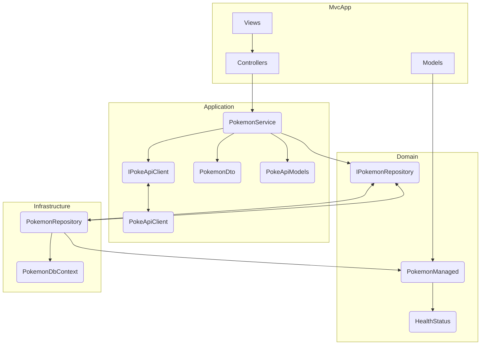

# PokeSolution

```mermaid
graph TD
    subgraph Application
        AC1(IPokeApiClient)
        AC2(PokeApiClient)
        AC3(PokemonService)
        AC4(PokemonDto)
        AC5(PokeApiModels)
    end

    subgraph Domain
        DC1(PokemonManaged)
        DC2(HealthStatus)
        DR1(IPokemonRepository)
    end

    subgraph Infrastructure
        IDC1(PokemonDbContext)
        IR1(PokemonRepository)
    end

    subgraph MvcApp
        MVC1[Controllers]
        MVC2[Models]
        MVC3[Views]
    end

    AC3 --> AC1
    AC1 <--> AC2
    AC3 --> DR1
    DR1 <--> IR1
    IR1 --> IDC1
    AC3 --> AC4
    AC3 --> AC5

    DC1 --> DC2
    IR1 --> DC1
    IR1 --> DR1

    MVC1 --> AC3
    MVC2 --> DC1
    MVC3 --> MVC1
```
